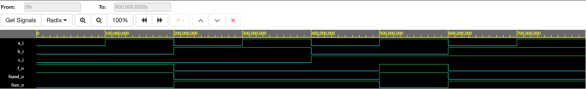

##GitHub link to Digital-electronics-1 repository:

https://github.com/KamilHolub/Digital-electronics-1

##De Morgans Law

##Table with logical values:

| **c** | **b** |**a** | **f(c,b,a)** |
| :-: | :-: | :-: | :-: |
| 0 | 0 | 0 | 1 |
| 0 | 0 | 1 | 1 |
| 0 | 1 | 0 | 0 |
| 0 | 1 | 1 | 0 |
| 1 | 0 | 0 | 0 |
| 1 | 0 | 1 | 1 |
| 1 | 1 | 0 | 0 |
| 1 | 1 | 1 | 0 |

## VHDL code:

```vhdl
entity gates is
    port(
        a_i     : in  std_logic;         -- Data input
        b_i     : in  std_logic;         -- Data input
        c_i     : in  std_logic;         -- Data input
        f_o     : out std_logic;         -- OR output function
        fnand_o : out std_logic;         -- NAND output function
        fnor_o  : out std_logic          -- NOR output function
    );
end entity gates;
```

##Screenshot with simulated time waveforms:



##Link to public EDA example:

https://www.edaplayground.com/x/MGKB