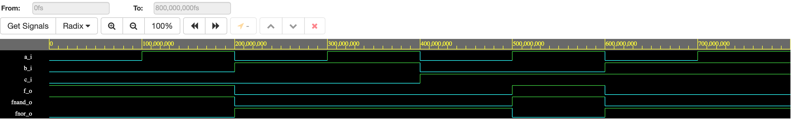
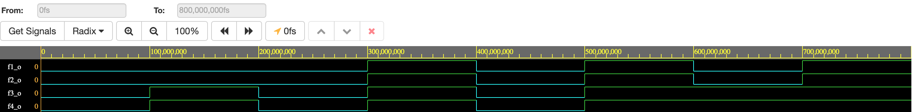

### GitHub link to Digital-electronics-1 repository:

https://github.com/KamilHolub/Digital-electronics-1

# De Morgan's Law

### Table with logical values:

| **c** | **b** |**a** | **f(c,b,a)** |
| :-: | :-: | :-: | :-: |
| 0 | 0 | 0 | 1 |
| 0 | 0 | 1 | 1 |
| 0 | 1 | 0 | 0 |
| 0 | 1 | 1 | 0 |
| 1 | 0 | 0 | 0 |
| 1 | 0 | 1 | 1 |
| 1 | 1 | 0 | 0 |
| 1 | 1 | 1 | 0 |

### VHDL code:

```vhdl
------------------------------------------------------------------------
-- Entity declaration for basic gates
------------------------------------------------------------------------
entity gates is
    port(
        a_i     : in  std_logic;         -- Data input
        b_i     : in  std_logic;         -- Data input
        c_i     : in  std_logic;         -- Data input
        f_o     : out std_logic;         -- OR output function
        fnand_o : out std_logic;         -- NAND output function
        fnor_o  : out std_logic.         -- NOR output function
    );
end entity gates;

------------------------------------------------------------------------
-- Architecture body for basic gates
------------------------------------------------------------------------
architecture dataflow of gates is
begin
    f_o     <= (a_i and (not b_i)) or ((not b_i) and (not c_i));
    fnand_o <= not (not (a_i and (not b_i)) and not ((not b_i) and (not c_i)));
    fnor_o  <= not ((a_i and (not b_i)) or ((not b_i) and (not c_i)));

end architecture dataflow;
```

### Screenshot with simulated time waveforms:



### Link to public EDA example:

https://www.edaplayground.com/x/MGKB

# Distributive law

### VHDL code:

```vhdl
------------------------------------------------------------------------
-- Entity declaration for basic gates
------------------------------------------------------------------------
entity gates is
    port(
        x_i     : in  std_logic;         -- Data input
        y_i     : in  std_logic;         -- Data input
        z_i     : in  std_logic;         -- Data input
        f1_o    : out std_logic;
        f2_o    : out std_logic;
        f3_o    : out std_logic;
        f4_o    : out std_logic
    );
end entity gates;

------------------------------------------------------------------------
-- Architecture body for basic gates
------------------------------------------------------------------------
architecture dataflow of gates is
begin
    f1_o  <= (x_i and y_i) or (x_i and z_i);
    f2_o  <= x_i and (y_i or z_i);
    f3_o  <= (x_i or y_i) and (x_i or z_i);
    f4_o  <= x_i or (y_i and z_i);

end architecture dataflow;
```
### Screenshot with simulated time waveforms:



### Link to public EDA example:

https://www.edaplayground.com/x/SiBU