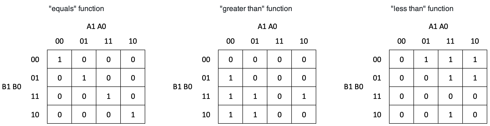
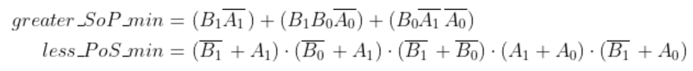

# 1. Preparation task

### 2-bit comparator truth table:

| **Dec. equivalent** | **B[1:0]** | **A[1:0]** | **B is greater than A** | **B equals A** | **B is less than A** |
| :-: | :-: | :-: | :-: | :-: | :-: |
| 0 | 0 0 | 0 0 | 0 | 1 | 0 |
| 1 | 0 0 | 0 1 | 0 | 0 | 1 |
| 2 | 0 0 | 1 0 | 0 | 0 | 1 |
| 3 | 0 0 | 1 1 | 0 | 0 | 1 |
| 4 | 0 1 | 0 0 | 1 | 0 | 0 |
| 5 | 0 1 | 0 1 | 0 | 1 | 0 |
| 6 | 0 1 | 1 0 | 0 | 0 | 1 |
| 7 | 0 1 | 1 1 | 0 | 0 | 1 |
| 8 | 1 0 | 0 0 | 0 | 0 | 0 |
| 9 | 1 0 | 0 1 | 1 | 0 | 0 |
| 10 | 1 0 | 1 0 | 1 | 1 | 0 |
| 11 | 1 0 | 1 1 | 0 | 0 | 1 |
| 12 | 1 1 | 0 0 | 0 | 0 | 0 |
| 13 | 1 1 | 0 1 | 1 | 0 | 0 |
| 14 | 1 1 | 1 0 | 1 | 0 | 0 |
| 15 | 1 1 | 1 1 | 1 | 1 | 0 |

### Canonical SoP and PoS forms for "equals" and "less than":


# 2. A 2-bit comparator

### Karnaugh maps:



### Simplified SoP form of the "greater than" function and PoS form of the "less than" function:



# A 4-bit binary comparator:

### Listing of VHDL architecture:

```vhdl
library ieee;
use ieee.std_logic_1164.all;

------------------------------------------------------------------------
-- Entity declaration for 4-bit binary comparator
------------------------------------------------------------------------
entity comparator_2bit is
    port(
        a_i           : in  std_logic_vector(4 - 1 downto 0);
        b_i           : in  std_logic_vector(4 - 1 downto 0);       

        -- COMPLETE ENTITY DECLARATION

        B_greater_A_o : out std_logic;
        B_equals_A_o  : out std_logic;
        B_less_A_o    : out std_logic       -- B is less than A
    );
end entity comparator_2bit;

------------------------------------------------------------------------
-- Architecture body for 4-bit binary comparator
------------------------------------------------------------------------
architecture Behavioral of comparator_2bit is
begin
    
    B_less_A_o   	<= '1' when (b_i < a_i) else '0';


    -- WRITE "GREATER" AND "EQUALS" ASSIGNMENTS HERE
    
    B_greater_A_o	<= '1' when (b_i > a_i) else '0';
    B_equals_A_o   	<= '1' when (b_i = a_i) else '0';

end architecture Behavioral;
```

### Listing of VHDL stimulus process from testbench file:

```vhdl
library ieee;
use ieee.std_logic_1164.all;

------------------------------------------------------------------------
-- Entity declaration for testbench
------------------------------------------------------------------------
entity tb_comparator_2bit is
    -- Entity of testbench is always empty
end entity tb_comparator_2bit;

------------------------------------------------------------------------
-- Architecture body for testbench
------------------------------------------------------------------------
architecture testbench of tb_comparator_2bit is

    -- Local signals
    signal s_a       : std_logic_vector(4 - 1 downto 0);
    signal s_b       : std_logic_vector(4 - 1 downto 0);
    signal s_B_greater_A : std_logic;
    signal s_B_equals_A  : std_logic;
    signal s_B_less_A    : std_logic;

begin
    -- Connecting testbench signals with comparator_4bit entity (Unit Under Test)
    uut_comparator_2bit : entity work.comparator_2bit
        port map(
            a_i           => s_a,
            b_i           => s_b,
            B_greater_A_o => s_B_greater_A,
            B_equals_A_o  => s_B_equals_A,
            B_less_A_o    => s_B_less_A
        );

    --------------------------------------------------------------------
    -- Data generation process
    --------------------------------------------------------------------
    p_stimulus : process
    begin
        -- Report a note at the begining of stimulus process
        report "Stimulus process started" severity note;


        -- First test values
        s_b <= "0000"; s_a <= "0000"; wait for 100 ns;
        -- Expected output
        assert ((s_B_greater_A = '0') and (s_B_equals_A = '1') and (s_B_less_A = '0'))
        -- If false, then report an error
        report "Test failed for input combination: 0000, 0000" severity error;
        
        
        -- WRITE OTHER TEST CASES HERE
        
        s_b <= "0000"; s_a <= "0001"; wait for 100 ns;
        assert ((s_B_greater_A = '0') and (s_B_equals_A = '0') and (s_B_less_A = '1'))
        report "Test failed for input combination: 0000, 0001" severity error;
        
        s_b <= "0010"; s_a <= "0010"; wait for 100 ns;
        assert ((s_B_greater_A = '0') and (s_B_equals_A = '1') and (s_B_less_A = '0'))
        report "Test failed for input combination: 0010, 0010" severity error;
        
        s_b <= "0011"; s_a <= "0010"; wait for 100 ns;
        assert ((s_B_greater_A = '1') and (s_B_equals_A = '0') and (s_B_less_A = '0'))
        report "Test failed for input combination: 0011, 0010" severity error;
        
        s_b <= "0100"; s_a <= "0101"; wait for 100 ns;
        assert ((s_B_greater_A = '0') and (s_B_equals_A = '0') and (s_B_less_A = '1'))
        report "Test failed for input combination: 0100, 0101" severity error;
        
        s_b <= "0101"; s_a <= "0011"; wait for 100 ns;
        assert ((s_B_greater_A = '1') and (s_B_equals_A = '0') and (s_B_less_A = '0'))
        report "Test failed for input combination: 0101, 0011" severity error;
        
        s_b <= "0111"; s_a <= "0111"; wait for 100 ns;
        assert ((s_B_greater_A = '0') and (s_B_equals_A = '1') and (s_B_less_A = '0'))
        report "Test failed for input combination: 0111, 0111" severity error;
        
        s_b <= "1000"; s_a <= "1001"; wait for 100 ns;
        assert ((s_B_greater_A = '0') and (s_B_equals_A = '0') and (s_B_less_A = '1'))
        report "Test failed for input combination: 1000, 1001" severity error;
        
        s_b <= "1001"; s_a <= "1001"; wait for 100 ns;
        assert ((s_B_greater_A = '0') and (s_B_equals_A = '1') and (s_B_less_A = '0'))
        report "Test failed for input combination: 1001, 1001" severity error;
        
        s_b <= "1110"; s_a <= "1000"; wait for 100 ns;
        assert ((s_B_greater_A = '1') and (s_B_equals_A = '0') and (s_B_less_A = '0'))
        report "Test failed for input combination: 1110, 1000" severity error;
        
        --to report error
        s_b <= "1111"; s_a <= "1111"; wait for 100 ns;
        assert ((s_B_greater_A = '1') and (s_B_equals_A = '0') and (s_B_less_A = '1'))
        report "Test failed for input combination: 1111, 1111" severity error;

        -- Report a note at the end of stimulus process
        report "Stimulus process finished" severity note;
        wait;
    end process p_stimulus;

end architecture testbench;
```

### Simulator console output:

```vhdl
analyze design.vhd
analyze testbench.vhd
elaborate tb_comparator_2bit
testbench.vhd:51:9:@0ms:(report note): Stimulus process started
testbench.vhd:102:9:@1100ns:(assertion error): Test failed for input combination: 1111, 1111
testbench.vhd:106:9:@1100ns:(report note): Stimulus process finished
Finding VCD file...
./dump.vcd
```


### Link to public EDA Playground example:

https://www.edaplayground.com/x/KEJu