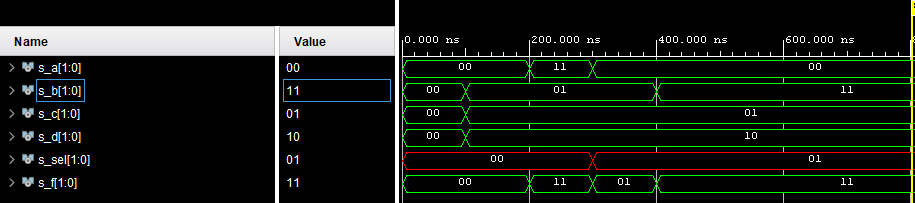

# 1. Preparation task

### Table with connection of slide switches and LEDs on Nexys A7 board :


# 2. Two-bit wide 4-to-1 multiplexer

### Listing of VHDL architecture:

```vhdl
architecture Behavioral of mux_2bit_4to1 is
begin
    
    f_o <= a_i when (sel_i = "00") else
           b_i when (sel_i = "01") else
           c_i when (sel_i = "10") else
           d_i;

end architecture Behavioral;
```

### Listing of VHDL stimulus process:

```vhdl
p_stimulus : process
    begin
        -- Report a note at the begining of stimulus process
        report "Stimulus process started" severity note;

        s_d <= "00"; s_c <= "00"; s_b <= "00"; s_a <= "00"; s_sel <= "00";
        wait for 100 ns;
        
        s_d <= "10"; s_c <= "01"; s_b <= "01"; s_a <= "00"; s_sel <= "00";
        wait for 100 ns;
        
        s_d <= "10"; s_c <= "01"; s_b <= "01"; s_a <= "11"; s_sel <= "00";
        wait for 100 ns;
        
        s_d <= "10"; s_c <= "01"; s_b <= "01"; s_a <= "00"; s_sel <= "01";
        wait for 100 ns;
        
        s_d <= "10"; s_c <= "01"; s_b <= "11"; s_a <= "00"; s_sel <= "01";
        wait for 100 ns;
        
        -- Report a note at the end of stimulus process
        report "Stimulus process finished" severity note;
        wait;
    end process p_stimulus;
```

### Simulated time waveforms:



# 3. A Vivado tutorial:

### Založení projektu:
1) Pro založení nového projektu po spuštění programu klikněte v úvodním okně na možnost Create Project.
2) Spustí se wizard pro založení projektu - klikněte na Next.
3) V kolonce Project name si pojmenujte nový projekt a v kolonce Project location zvolte adresář pro uložení nového projektu. Klikněte na Next.
4) Zvolte RTL Project a klikněte na Next.
5) Pomocí tlačítka Create File založíte na disku novou zdrojovou složku. V kolonce File type zvolte jazyk VHDL a v kolonce File name si zvolte název souboru a potvrďte tlačítkem OK. U Target language a Simulator language zvolte jazyk VHDL. Toto lze provézt i později v samotném projektu. Klikněte na Next.
6) Klikněte na Next
7) V záložce Boards zvolte desku Nexys A7-50T a klikněte na Next.
8) V okně Project summary klikněte na Finish
9) V okně Define Module je možnost nadefinovat si vstupy a výstupy. Klikněte na OK.
10) V okně Sources rozbalte záložku Design Sources a zvolte Vámi pojmenovaný soubor.
### Přidání souboru testbench:
1) V horním panelu klikněte na File > Add Sources... Označte možnost Add or create simulation source a klikněte na Next.
2) Vytvoříte nový soubor pomocí tlačítka Create File. V kolonce File type zvolte jazyk VHDL a v kolonce File name si zvolte název souboru a potvrďte tlačítkem OK. Klikněte na Finish.
3) V okně Define Module je možnost nadefinovat si vstupy a výstupy. Klikněte na OK.
4) V okně Sources rozbalte záložku Simulation Sources a zvolte Vámi pojmenovaný soubor.
### Spuštění simulace:
V horním panelu klikněte na Flow > Run Simulation > Run Behavioral Simulation.