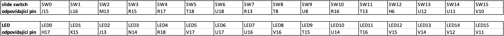

# 1. Preparation task

### Table with connection of slide switches and LEDs on Nexys A7 board :



# 2. Two-bit wide 4-to-1 multiplexer

### Listing of VHDL architecture:

```vhdl
architecture Behavioral of mux_2bit_4to1 is
begin
    
    f_o <= a_i when (sel_i = "00") else
           b_i when (sel_i = "01") else
           c_i when (sel_i = "10") else
           d_i;

end architecture Behavioral;
```

### Listing of VHDL stimulus process:

```vhdl
p_stimulus : process
    begin
        -- Report a note at the begining of stimulus process
        report "Stimulus process started" severity note;

        s_d <= "00"; s_c <= "00"; s_b <= "00"; s_a <= "00"; s_sel <= "00";
        wait for 100 ns;
        
        s_d <= "10"; s_c <= "01"; s_b <= "01"; s_a <= "00"; s_sel <= "00";
        wait for 100 ns;
        
        s_d <= "10"; s_c <= "01"; s_b <= "01"; s_a <= "11"; s_sel <= "00";
        wait for 100 ns;
        
        s_d <= "10"; s_c <= "01"; s_b <= "01"; s_a <= "00"; s_sel <= "01";
        wait for 100 ns;
        
        s_d <= "10"; s_c <= "01"; s_b <= "11"; s_a <= "00"; s_sel <= "01";
        wait for 100 ns;
        
        -- Report a note at the end of stimulus process
        report "Stimulus process finished" severity note;
        wait;
    end process p_stimulus;
```

### Simulated time waveforms:


# A Vivado tutorial:

## Založení projektu:
### Pro založení nového projektu po spuštění programu klikněte v úvodním okně na možnost Create Project
### Spustí se wizard pro založení projektu - klikněte na Next
### 