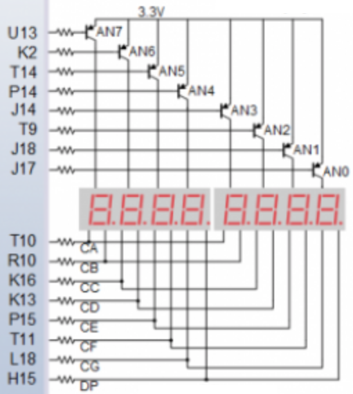
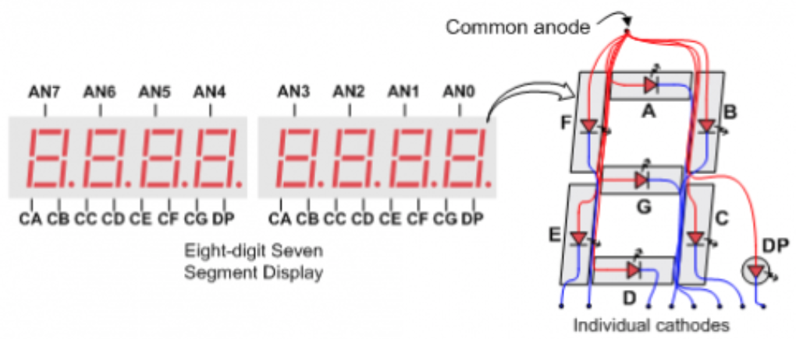
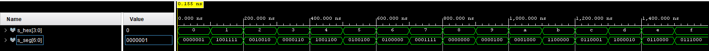
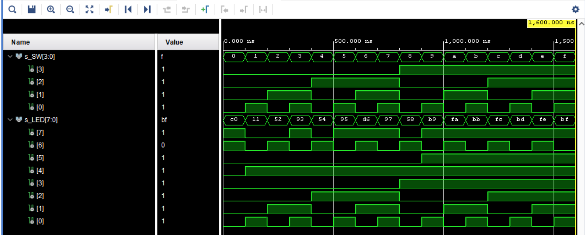

# 1. Preparation task

### Connection of 7-segment displays on Nexys A7 board:

Výstup AN reprezentuje společné anodové signály pro jednotlivé displeje, což jsou tranzistory AN0 až AN7. Vzhledem k tomu, že jsou v zapojení tranzistory PNP a na emitoru je 3,3 V, pro otevření tranzistoru musí být signály do báze od jednotlivých pinů 0.




Výstupy CA až CG reprezentuji individuální katody pro jednotlivé segmenty displejů.



### Decoder truth table for common anode 7-segment display:

| **Hex** | **Inputs** | **A** | **B** | **C** | **D** | **E** | **F** | **G** |
| :-: | :-: | :-: | :-: | :-: | :-: | :-: | :-: | :-: |
| 0 | 0000 | 0 | 0 | 0 | 0 | 0 | 0 | 1 |
| 1 | 0001 | 1 | 0 | 0 | 1 | 1 | 1 | 1 |
| 2 | 0010 | 0 | 0 | 1 | 0 | 0 | 1 | 0 |
| 3 | 0011 | 0 | 0 | 0 | 0 | 1 | 1 | 0 |
| 4 | 0100 | 1 | 0 | 0 | 1 | 1 | 0 | 0 |
| 5 | 0101 | 0 | 1 | 0 | 0 | 1 | 0 | 0 |
| 6 | 0110 | 0 | 1 | 0 | 0 | 0 | 0 | 0 |
| 7 | 0111 | 0 | 0 | 0 | 1 | 1 | 1 | 1 |
| 8 | 1000 | 0 | 0 | 0 | 0 | 0 | 0 | 0 |
| 9 | 1001 | 0 | 0 | 0 | 0 | 1 | 0 | 0 |
| A | 1010 | 0 | 0 | 0 | 1 | 0 | 0 | 0 |
| b | 1011 | 1 | 1 | 0 | 0 | 0 | 0 | 0 |
| C | 1100 | 0 | 1 | 1 | 0 | 0 | 0 | 1 |
| d | 1101 | 1 | 0 | 0 | 0 | 0 | 1 | 0 |
| E | 1110 | 0 | 1 | 1 | 0 | 0 | 0 | 0 |
| F | 1111 | 0 | 1 | 1 | 1 | 0 | 0 | 0 |

# 2. Seven-segment display decoder

### VHDL architecture from source file hex_7seg.vhd:
```vhdl
architecture Behavioral of hex_7seg is

begin
    p_7seg_decoder : process(hex_i)
    begin
        case hex_i is
            when "0000" =>
                seg_o <= "0000001";     -- 0
            when "0001" =>
                seg_o <= "1001111";     -- 1
            when "0010" =>              
                seg_o <= "0010010";     -- 2
            when "0011" =>              
                seg_o <= "0000110";     -- 3
            when "0100" =>
                seg_o <= "1001100";     -- 4
            when "0101" =>
                seg_o <= "0100100";     -- 5
            when "0110" =>
                seg_o <= "0100000";     -- 6
            when "0111" =>
                seg_o <= "0001111";     -- 7
            when "1000" =>
                seg_o <= "0000000";     -- 8
            when "1001" =>
                seg_o <= "0000100";     -- 9
            when "1010" =>
                seg_o <= "0001000";     -- A
            when "1011" =>
                seg_o <= "1100000";     -- b
            when "1100" =>
                seg_o <= "0110001";     -- C
            when "1101" =>
                seg_o <= "1000010";     -- d
            when "1110" =>
                seg_o <= "0110000";     -- E
            when others =>
                seg_o <= "0111000";     -- F
        end case;
    end process p_7seg_decoder;

end architecture Behavioral;
```
### VHDL stimulus process from testbench file tb_hex_7seg.vhd:
```vhdl
p_stimulus : process
    begin
        -- Report a note at the begining of stimulus process
        report "Stimulus process started" severity note;
        
        s_hex <= "0000"; wait for 100 ns;
        s_hex <= "0001"; wait for 100 ns;
        s_hex <= "0010"; wait for 100 ns;
        s_hex <= "0011"; wait for 100 ns;
        s_hex <= "0100"; wait for 100 ns;
        s_hex <= "0101"; wait for 100 ns;
        s_hex <= "0110"; wait for 100 ns;
        s_hex <= "0111"; wait for 100 ns;
        s_hex <= "1000"; wait for 100 ns;
        s_hex <= "1001"; wait for 100 ns;
        s_hex <= "1010"; wait for 100 ns;
        s_hex <= "1011"; wait for 100 ns;
        s_hex <= "1100"; wait for 100 ns;
        s_hex <= "1101"; wait for 100 ns;
        s_hex <= "1110"; wait for 100 ns;
        s_hex <= "1111"; wait for 100 ns;


        
        -- Report a note at the end of stimulus process
        report "Stimulus process finished" severity note;
        wait;
    end process p_stimulus;
```
### Screenshot with simulated time waveforms:



### VHDL code from source file top.vhd with 7-segment module instantiation:

```vhdl
-- Instance (copy) of hex_7seg entity
    hex7seg : entity work.hex_7seg
        port map(
            hex_i    => SW,
            seg_o(6) => CA,
            seg_o(5) => CB,
            seg_o(4) => CC,
            seg_o(3) => CD,
            seg_o(2) => CE,
            seg_o(1) => CF,
            seg_o(0) => CG
        );
```
# 3. LED(7:4) indicators

### Truth table and listing of VHDL code for LEDs(7:4) with syntax highlighting:

| **Hex** | **Inputs** | **LED4** | **LED5** | **LED6** | **LED7** |
| :-: | :-: | :-: | :-: | :-: | :-: |
| 0 | 0000 | 1 | 0 | 0 | 0 |
| 1 | 0001 | 0 | 0 | 1 | 1 |
| 2 | 0010 | 0 | 0 | 0 | 1 |
| 3 | 0011 | 0 | 0 | 1 | 0 |
| 4 | 0100 | 0 | 0 | 0 | 1 |
| 5 | 0101 | 0 | 0 | 1 | 0 |
| 6 | 0110 | 0 | 0 | 0 | 0 |
| 7 | 0111 | 0 | 0 | 1 | 0 |
| 8 | 1000 | 0 | 0 | 0 | 1 |
| 9 | 1001 | 0 | 0 | 1 | 0 |
| A | 1010 | 0 | 1 | 0 | 0 |
| b | 1011 | 0 | 1 | 1 | 0 |
| C | 1100 | 0 | 1 | 0 | 0 |
| d | 1101 | 0 | 1 | 1 | 0 |
| E | 1110 | 0 | 1 | 0 | 0 |
| F | 1111 | 0 | 1 | 1 | 0 |

```vhdl
architecture Behavioral of top is

begin

-- Instance (copy) of hex_7seg entity
    hex7seg : entity work.hex_7seg
        port map(
            hex_i    => SW,
            seg_o(6) => CA,
            seg_o(5) => CB,
            seg_o(4) => CC,
            seg_o(3) => CD,
            seg_o(2) => CE,
            seg_o(1) => CF,
            seg_o(0) => CG
        );
        
        -- Connect one common anode to 3.3V
       AN <= b"1111_0111";
        
        -- Display input value on LEDs
       LED(3 downto 0) <= SW;
        
       LED4 : process (SW)
            begin
                if (SW = "0000") then
                    LED(4) <= '0';
                else
                    LED(4) <= '1';
                end if;
            end process LED4;
            
        LED5 : process (SW)
            begin
                if (SW < b"1001") then
                    LED(5) <= '0';
                else
                    LED(5) <= '1';
                end if;
            end process LED5;
    
        LED6 : process (SW)
            begin
                if (SW(0) = '1') then
                    LED(6) <= '0';
                else
                    LED(6) <= '1';
                end if;
            end process LED6;
            
        LED7 : process (SW)
            begin            
                case SW is
                    when "0001" =>
                    LED(7) <= '0';
                    when "0010" =>
                    LED(7) <= '0';
                    when "0100" =>
                    LED(7) <= '0';
                    when "1000" =>
                    LED(7) <= '0';
                    when others =>
                    LED(7) <= '1';
            end case;
            end process LED7;

end Behavioral;
```
### Screenshot with simulated time waveforms:



