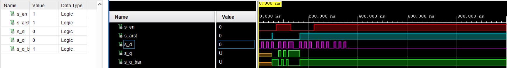
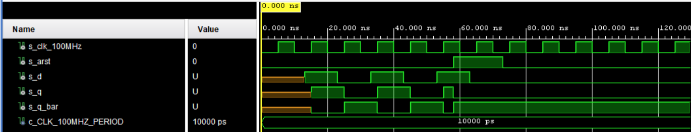
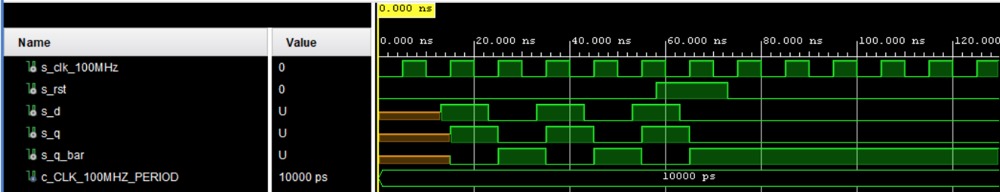
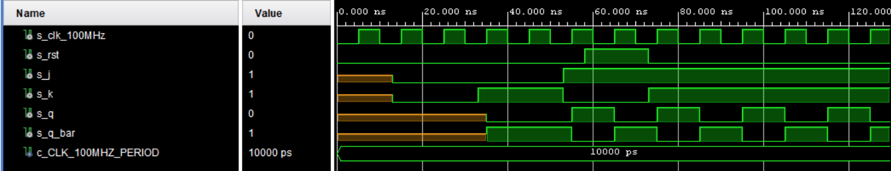
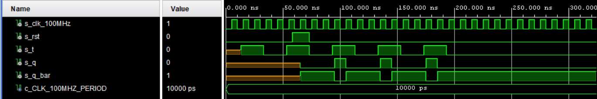
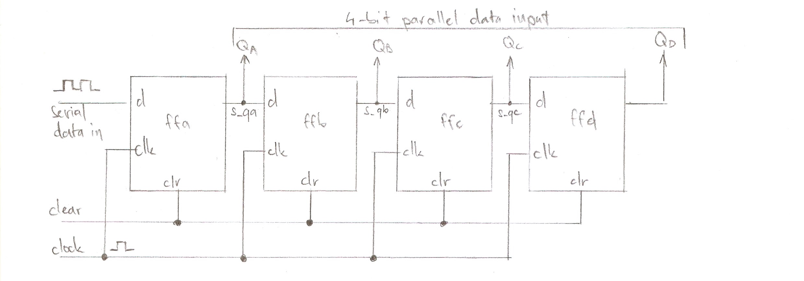

# 1. Preparation task

### Characteristic equations:


### Completed tables for D, JK, T flip-flops:

   | **clk** | **d** | **q(n)** | **q(n+1)** | **Comments** |
   | :-: | :-: | :-: | :-: | :-- |
   |  | 0 | 0 | 0 | Input signal is sampled at the rising edge of clk and stored to FF |
   |  | 0 | 1 | 0 | No change |
   |  | 1 | 0 | 1 | Input signal is sampled at the rising edge of clk and stored to FF |
   |  | 1 | 1 | 1 | No change |

| **clk** | **j** | **k** | **q(n)** | **q(n+1)** | **Comments** |
   | :-: | :-: | :-: | :-: | :-: | :-- |
   |  | 0 | 0 | 0 | 0 | No change |
   |  | 0 | 0 | 1 | 1 | No change |
   |  | 0 | 1 | 0 | 0 | Reset |
   |  | 0 | 1 | 1 | 0 | Reset |
   |  | 1 | 1 | 0 | 1 | Set |
   |  | 1 | 1 | 1 | 1 | Set |
   |  | 1 | 1 | 0 | 1 | Toggle |
   |  | 1 | 1 | 1 | 0 | Toggle |

| **clk** | **t** | **q(n)** | **q(n+1)** | **Comments** |
   | :-: | :-: | :-: | :-: | :-- |
   |  | 0 | 0 | 0 | No change |
   |  | 0 | 1 | 1 | No change |
   |  | 1 | 0 | 1 | Toggle |
   |  | 1 | 1 | 0 | Toggle |

# 2. D latch

### VHDL code listing of the process p_d_latch with syntax highlighting:
```vhdl
 p_d_latch : process (d, arst, en)
    begin
        if (arst = '1') then
                q     <= '0';
                q_bar <= '1'; 
        elsif (en = '1') then
                q     <= d;
                q_bar <= not d;
        end if;
    end process p_d_latch;
```

### VHDL reset and stimulus processes from the testbench tb_d_latch.vhd:

```vhdl
p_reset_gen : process
        begin
            s_arst <= '0';
            wait for 53 ns;
        
            -- Reset activated
            s_arst <= '1';
            wait for 5 ns;

            -- Reset deactivated
            s_arst <= '0';
            
            
            wait for 108 ns;
            s_arst <= '1';

        wait;
    end process p_reset_gen;
```
```vhdl
p_stimulus : process
     begin
        report "Stimulus process started" severity note;
        
            s_en <= '0';
            s_d  <= '0';
           
            -- d sequence
            wait for 10 ns;
            s_d <= '1';
            wait for 10 ns;
            s_d <= '0';
            wait for 10 ns;
            s_d <= '1';
            wait for 10 ns;
            s_d <= '0';
            wait for 10 ns;
            s_d <= '1';
            wait for 10 ns;
            s_d <= '0';
            wait for 10 ns;
            -- /d sequence
            
            s_en <= '1';
            
            wait for 3 ns;
            assert(s_q = '0' and s_q_bar = '1')
            report "incorrect" severity error;
            
            -- d sequence
            wait for 7 ns;
            s_d <= '1';
            wait for 10 ns;
            s_d <= '0';
            wait for 10 ns;
            s_d <= '1';
            wait for 10 ns;
            s_d <= '0';
            wait for 10 ns;
            s_d <= '1';
            wait for 10 ns;
            s_en <= '0';
            wait for 10 ns;            
            s_d <= '0';
            wait for 10 ns;
            -- /d sequence
            
            -- s_arst <= '1';
            wait for 3 ns;
            assert(s_d = '0' and s_en = '1')
            report "incorrect" severity error;
            
            -- d sequence
            wait for 10 ns;
            s_d <= '1';
            wait for 10 ns;
            s_d <= '0';
            wait for 10 ns;
            s_d <= '1';
            wait for 10 ns;
            s_d <= '0';
            wait for 10 ns;
            s_d <= '1';
            wait for 10 ns;
            s_d <= '0';
            wait for 10 ns;
            -- /d sequence
            
            s_en <= '1';
            
            -- d sequence
            wait for 10 ns;
            s_d <= '1';
            wait for 10 ns;
            s_d <= '0';
            wait for 10 ns;
            s_d <= '1';
            wait for 10 ns;
            s_d <= '0';
            wait for 10 ns;
            s_d <= '1';
            wait for 10 ns;
            s_d <= '0';
            wait for 10 ns;
            -- /d sequence
            
            
            -- d sequence
            wait for 10 ns;
            s_d <= '1';
            wait for 10 ns;
            s_d <= '0';
            wait for 10 ns;
            s_d <= '1';
            wait for 10 ns;
            s_d <= '0';
            wait for 10 ns;
            s_d <= '1';
            wait for 10 ns;
            s_d <= '0';
            wait for 10 ns;
            -- /d sequence

        report "Stimulus process finished" severity note;
        wait;
    end process p_stimulus;
```

### Screenshot with simulated time waveforms



# 3. Flip-flops

## D type flip-flop with an async reset:

### VHDL code listing of the process:

```vhdl
p_d_ff_arst : process (clk, arst)
     begin
        if (arst = '1') then
                q     <= '0';
                q_bar <= '1';
                
        elsif rising_edge(clk) then
                q     <= d;
                q_bar <= not d;
                
        end if;
     end process p_d_ff_arst;
```

### Clock, reset and stimulus process:

```vhdl
--------------------------------------------------------------------
    -- Clock generation process
    --------------------------------------------------------------------
    p_clk_gen : process
    begin
        while now < 750 ns loop         -- 75 periods of 100MHz clock
            s_clk_100MHz <= '0';
            wait for c_CLK_100MHZ_PERIOD / 2;
            s_clk_100MHz <= '1';
            wait for c_CLK_100MHZ_PERIOD / 2;
        end loop;
        wait;
    end process p_clk_gen;
    
    --------------------------------------------------------------------
    -- Reset generation process
    --------------------------------------------------------------------
    --- WRITE YOUR CODE HERE
    p_reset_gen : process
    begin
        s_arst <= '0';
        wait for 58 ns;
        
        -- Reset activated
        s_arst <= '1';
        wait for 15 ns;

        -- Reset deactivated
        s_arst <= '0';

        wait;
    end process p_reset_gen;
    
    --------------------------------------------------------------------
    -- Data generation process
    --------------------------------------------------------------------
    p_stimulus : process
    begin
        report "Stimulus process started" severity note;
        
            -- d sequence
            wait for 13 ns;
            s_d <= '1';
            wait for 10 ns;
            s_d <= '0';
            wait for 10 ns;
            s_d <= '1';
            wait for 10 ns;
            s_d <= '0';
            wait for 10 ns;
            s_d <= '1';
            wait for 10 ns;            
            s_d <= '0';
            wait for 10 ns;
            -- /d sequence
          

        report "Stimulus process finished" severity note;
        wait;
    end process p_stimulus;
```
### Screenshot with simulated time waveforms:



## D type flip-flop with a sync reset:

### VHDL code listing of the process:

```vhdl
p_d_ff_rst : process (clk)
    begin
        if rising_edge(clk) then
            if (rst = '1') then
                s_q <= '0';
            else
                if (d = '0') then
                    s_q <= '0';
                elsif (d = '1') then
                    s_q <= '1';
                end if;
            end if;
        end if;
     end process p_d_ff_rst;
```

### Clock, reset and stimulus process:

```vhdl
--------------------------------------------------------------------
    -- Clock generation process
    --------------------------------------------------------------------
    p_clk_gen : process
    begin
        while now < 750 ns loop         -- 75 periods of 100MHz clock
            s_clk_100MHz <= '0';
            wait for c_CLK_100MHZ_PERIOD / 2;
            s_clk_100MHz <= '1';
            wait for c_CLK_100MHZ_PERIOD / 2;
        end loop;
        wait;
    end process p_clk_gen;
    
    --------------------------------------------------------------------
    -- Reset generation process
    --------------------------------------------------------------------
    --- WRITE YOUR CODE HERE
    p_reset_gen : process
    begin
        s_rst <= '0';
        wait for 58 ns;
        
        -- Reset activated
        s_rst <= '1';
        wait for 15 ns;

        -- Reset deactivated
        s_rst <= '0';

        wait;
    end process p_reset_gen;
    --------------------------------------------------------------------
    -- Data generation process
    --------------------------------------------------------------------
    p_stimulus : process
    begin
        report "Stimulus process started" severity note;
        
           -- d sequence
            wait for 13 ns;
            s_d <= '1';
            wait for 10 ns;
            s_d <= '0';
            wait for 10 ns;
            s_d <= '1';
            wait for 10 ns;
            s_d <= '0';
            wait for 10 ns;
            s_d <= '1';
            wait for 10 ns;            
            s_d <= '0';
            wait for 10 ns;
            -- /d sequence

        report "Stimulus process finished" severity note;
        wait;
    end process p_stimulus;
```
### Screenshot with simulated time waveforms:



## JK type flip-flop with a sync reset:

### VHDL code listing of the process:
```vhdl
 p_jk_ff_rst : process (clk)
    begin
        if rising_edge(clk) then
            if (rst = '1') then
                s_q <= '0';
            else
                if (j = '0' and k = '0') then
                    s_q <= s_q;
                elsif (j = '0' and k = '1') then
                    s_q <= '0';
                elsif (j = '1' and k = '0') then
                    s_q <= '1';
                elsif (j = '1' and k = '1') then
                    s_q <= not s_q;
                end if;
 
            end if;
        end if;
     end process p_jk_ff_rst;
```

### Clock, reset and stimulus process:

```vhdl
--------------------------------------------------------------------
    -- Clock generation process
    --------------------------------------------------------------------
    p_clk_gen : process
    begin
        while now < 750 ns loop         -- 75 periods of 100MHz clock
            s_clk_100MHz <= '0';
            wait for c_CLK_100MHZ_PERIOD / 2;
            s_clk_100MHz <= '1';
            wait for c_CLK_100MHZ_PERIOD / 2;
        end loop;
        wait;
    end process p_clk_gen;
    
    --------------------------------------------------------------------
    -- Reset generation process
    --------------------------------------------------------------------
    --- WRITE YOUR CODE HERE
    p_reset_gen : process
    begin
        s_rst <= '0';
        wait for 58 ns;
        
        -- Reset activated
        s_rst <= '1';
        wait for 15 ns;

        -- Reset deactivated
        s_rst <= '0';

        wait;
    end process p_reset_gen;
    --------------------------------------------------------------------
    -- Data generation process
    --------------------------------------------------------------------
    p_stimulus : process
    begin
        report "Stimulus process started" severity note;
        
            -- d sequence
            wait for 13 ns;
            s_j <= '0';
            s_k <= '0';
            wait for 20 ns;
            s_j <= '0';
            s_k <= '1';
            wait for 20 ns;
            s_j <= '1';
            s_k <= '0';
            wait for 20 ns;
            s_j <= '1';
            s_k <= '1';

        report "Stimulus process finished" severity note;
        wait;
    end process p_stimulus;
```
### Screenshot with simulated time waveforms:



## T type flip-flop with a sync reset:

### VHDL code listing of the process:

```vhdl
p_t_ff_rst : process (clk)
   begin
        if rising_edge(clk) then
            if (rst = '1') then
                s_q <= '0';
            else
                if (t = '0') then
                    s_q <= s_q;
                elsif (t = '1') then
                    s_q <= not s_q;
                end if;
            end if;
        end if;
     end process p_t_ff_rst;
```
### Clock, reset and stimulus process:

```vhdl
--------------------------------------------------------------------
    -- Clock generation process
    --------------------------------------------------------------------
    p_clk_gen : process
    begin
        while now < 750 ns loop         -- 75 periods of 100MHz clock
            s_clk_100MHz <= '0';
            wait for c_CLK_100MHZ_PERIOD / 2;
            s_clk_100MHz <= '1';
            wait for c_CLK_100MHZ_PERIOD / 2;
        end loop;
        wait;
    end process p_clk_gen;
    
    --------------------------------------------------------------------
    -- Reset generation process
    --------------------------------------------------------------------
    --- WRITE YOUR CODE HERE
    p_reset_gen : process
    begin
        s_rst <= '0';
        wait for 58 ns;
        
        -- Reset activated
        s_rst <= '1';
        wait for 15 ns;

        -- Reset deactivated
        s_rst <= '0';

        wait;
    end process p_reset_gen;
    --------------------------------------------------------------------
    -- Data generation process
    --------------------------------------------------------------------
    p_stimulus : process
    begin
        report "Stimulus process started" severity note;
        
           -- d sequence
            wait for 13 ns;
            s_t <= '1';
            wait for 20 ns;
            s_t <= '0';
            wait for 20 ns;
            s_t <= '1';
            wait for 20 ns;
            s_t <= '0';
            wait for 20 ns;
            s_t <= '1';
            wait for 20 ns;            
            s_t <= '0';
            wait for 20 ns;
            s_t <= '1';
            wait for 20 ns;            
            s_t <= '0';
            wait for 20 ns;
            s_t <= '1';
            wait for 20 ns;            
            s_t <= '0';
            wait for 20 ns;
            
            -- /d sequence

        report "Stimulus process finished" severity note;
        wait;
    end process p_stimulus;
```
### Screenshot with simulated time waveforms:



# Shift register


